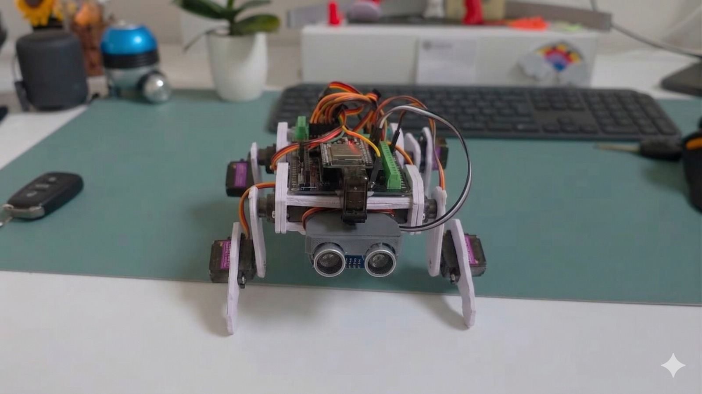

https://x.com/AlbertRDog</br>
DGJg1Xsru3vS6wDvcByYpioJDcfHjX8g2v9oDTkwpump
<p align="center">
  
  
  
  
  
</p>

<h1 align="center">Albert: The Desktop Robot Dog</h1>

<p align="center">
  <strong>A low-cost, ESP32-powered quadruped robot dog built with hand-cut PVC sheets</strong>
  <br>
  No 3D printer required | Modular design | Easy to repair
</p>

<p align="center">
  <a href="#-key-features">Features</a> •
  <a href="#-hardware-requirements">Hardware</a> •
  <a href="#-software-architecture">Software</a> •
  <a href="#-building-guide">Build Guide</a> •
  <a href="#-control-commands">Commands</a> •
  <a href="#-installation">Installation</a>
</p>

---

## Project Overview

**Albert** is a quadruped robot dog designed for smooth, organic movement and modular extensibility. This repository contains the core firmware built to handle complex gait cycles, inverse kinematics-style positioning, and remote control via Bluetooth.

Unlike other robot dog projects that require expensive 3D printers, Albert uses **hand-cut PVC sheets** as the primary structural material—making it accessible to anyone with basic tools.

<p align="center">
  
</p>

## Key Features

| Feature | Description |
|---------|-------------|
| **Sinusoidal Gait Engine** | Uses mathematical sine waves to produce fluid, lifelike walking patterns rather than jerky linear movements |
| **Synchronized Interpolation** | A blocking move system that ensures all legs reach their target position simultaneously |
| **Dual-Control Interface** | Supports commands via Serial (USB) and Bluetooth (ESP32) |
| **Manual Override** | Custom parser allows real-time manual servo positioning (e.g., `0,325-15,400`) |
| **Pre-programmed Poses** | Built-in sequences for "Gallop," "Handshake," "Sit," and "Top" poses |
| **Obstacle Detection** | Ultrasonic sensor for autonomous environment interaction |
| **Affordable** | Total build cost under $50 |
| **Easy Repair** | Modular design allows quick servo replacement |

## Specifications

### Hardware Overview

| Component | Specification |
|-----------|---------------|
| **Microcontroller** | ESP32 (on breakout board) |
| **Servo Driver** | PCA9685 16-Channel 12-bit PWM Driver |
| **Servos** | 9x MG90S Micro Servos |
| **Sensor** | HC-SR04 Ultrasonic Sensor |
| **Frame Material** | Hand-cut PVC Sheets |
| **Power** | 5V USB Power Bank |
| **Communication** | Serial (USB), Bluetooth |

### Servo Configuration

| Location | Quantity | Function |
|----------|----------|----------|
| Front Left Leg | 2 | Hip + Knee movement |
| Front Right Leg | 2 | Hip + Knee movement |
| Rear Left Leg | 2 | Hip + Knee movement |
| Rear Right Leg | 2 | Hip + Knee movement |
| Neck | 1 | Head pan movement |
| **Total** | **9 DOF** | |

### Degrees of Freedom (DOF)

```
FRONT LEFT LEG (2 DOF)          FRONT RIGHT LEG (2 DOF)
├── Hip Servo                   ├── Hip Servo
└── Knee Servo                  └── Knee Servo

              NECK (1 DOF)
              └── Pan Servo + Ultrasonic Sensor

REAR LEFT LEG (2 DOF)           REAR RIGHT LEG (2 DOF)
├── Hip Servo                   ├── Hip Servo
└── Knee Servo                  └── Knee Servo

Total: 9 DOF
```

## Software Architecture

The code is organized into several distinct layers:

| Layer | Description |
|-------|-------------|
| **Configuration** | Define servo limits (`SERVOMIN`/`SERVOMAX`) and center points |
| **Interpolation Engine** | `moveUntilReachedAll()` handles smooth transitions between poses |
| **Gait Engine** | `runWalkSequence()` uses frequency/amplitude model for walking |
| **Command Parser** | Interprets string commands into robot modes or servo movements |
| **State Machine** | Handles behaviors like "Play," "Turn Logic," and directional movement |

### Libraries Used

```cpp
#include <Wire.h>                    // I2C Communication
#include <Adafruit_PWMServoDriver.h> // Servo Control
```

## Building Guide

### Tools Required

- Utility knife / scissors
- Electric screwdriver
- Pen (for marking)
- Hot glue gun

### Assembly Steps

1. **Leg Fabrication** - Cut PVC pieces for lower and upper leg segments
2. **Joint Assembly** - Mount 2 servos per leg (2 DOF each)
3. **Wiring** - Connect servo driver to ESP32 via I2C
   - SDA → GPIO 21
   - SCL → GPIO 22
4. **Body Construction** - Cut main PVC plate as chassis, mount ESP32 & servo driver
5. **Leg Integration** - Attach 4 leg assemblies to body using PVC supports
6. **Head Assembly** - Add neck servo and mount ultrasonic sensor
7. **Power** - Attach power bank to underside for mobile power
8. **Programming** - Upload firmware via Arduino IDE

## Control Commands

Commands can be sent via **Serial Monitor** (115200 baud) or **Bluetooth Serial**:

| Command | Action |
|---------|--------|
| `WALK` | Walk forward in a continuous loop |
| `LEFT` / `RIGHT` | Dynamic turning while moving |
| `LS` / `RS` | Spin on the spot (Left/Right) |
| `STOP` | Immediate stop and hold position |
| `UP` / `DOWN` | Adjust stand height |
| `GALLOP` | High-energy forward lunging sequence |
| `HAND` | Perform a handshake gesture |

**Manual Mode Example:** `0,400-1,200-15,350` (Moves Servo 0 to 400, Servo 1 to 200, and Neck to 350 simultaneously)

## Gait Logic (The Math)

Albert's walk is powered by a sinusoidal oscillator:

$$pulse = Center + Offset + (Amplitude \cdot \cos(t + Phase))$$

By shifting the `Phase` for each leg, we create the classic "trot" gait. The lift servos (odd indices) use a rectified cosine function to ensure the feet only move upward during the swing phase.

## Repository Structure

```
Albert-Robot-Dog/
├── code/
│   ├── ALBERT_BT_Control_plot.ino    # Bluetooth control with serial plotting
│   ├── ALBERT_autonomous.ino          # Autonomous behavior mode
│   └── ALBERT_hand_following.ino      # Hand-following mode
├── stl files/
│   └── DOG 3D V 0.2.stl              # Optional 3D printable parts
├── LICENSE
└── README.md
```

## Installation

### Prerequisites

| Requirement | Version |
|-------------|---------|
| Arduino IDE | 2.0+ |
| ESP32 Board Manager | Latest |
| Adafruit PWM Library | Latest |

### Setup Steps

1. Clone this repository
   ```bash
   git clone https://github.com/raulzp11/Albert-Robot-Dog.git
   ```

2. Install **Adafruit PWM Servo Driver Library** via Arduino Library Manager

3. Install **ESP32 Board Manager** in Arduino IDE
   - Add URL: `https://dl.espressif.com/dl/package_esp32_index.json`

4. Open desired `.ino` file from `code/` folder

5. Select board: **ESP32 Dev Module**

6. Upload and open **Serial Plotter** to see gait waves in real-time

## Roadmap

- [x] Core servo control firmware
- [x] Sinusoidal gait engine
- [x] Bluetooth control interface
- [x] Autonomous obstacle avoidance
- [x] Hand-following mode
- [ ] Mobile app control
- [ ] Voice command integration
- [ ] Camera vision module
- [ ] ROS2 integration


## Contributing

1. Fork the repository
2. Create your feature branch (`git checkout -b feature/amazing-feature`)
3. Commit your changes (`git commit -m 'Add amazing feature'`)
4. Push to the branch (`git push origin feature/amazing-feature`)
5. Open a Pull Request

## License

This project is licensed under the **GPL-3.0 License** - see the [LICENSE](LICENSE) file for details.

## Acknowledgments

- **Thinking Things** - Original Albert robot dog project
- **Adafruit** - PWM Servo Driver library
- **Espressif** - ESP32 platform

---

<p align="center">
  <strong>Building Affordable Robotics - One Servo at a Time</strong>
</p>
